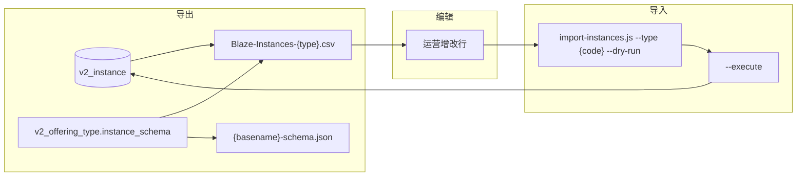

# Instance CSV Import — 设计说明与操作手册

| 项目 | 内容 |
|------|------|
| 状态 | 已实现 |
| 版本 | 1.0 |
| 日期 | 2026-06-04 |
| Cursor 规则 | `.cursor/rules/instance-csv-import.mdc` |
| 相关规则 | `.cursor/rules/database-schema.mdc`、`product-hierarchy.mdc` |
| Offering 导入 | `scripts/design/offering-csv-import.md` |
| Legacy unified（已归档） | `_archive/scripts/design/unified-instance-import.md` |

---

## 1. 背景与目标

运营需批量维护 **`v2_instance`**（Admin 称 instance / 场次；C 端 **Session** 可报名对象）。

本流程支持 **Export → 编辑 CSV → Import** 闭环，FK 链比 offering 更长：

```text
franchise → category → program → offering → instance
(+ optional campus)
```

**Schema 模式（唯一路径）：** 每个 active offering type 单独 CSV + `{basename}-schema.json` manifest。 **`v2_offering_type.instance_schema`** 动态生成；Admin 修改 schema 后须重新 export。



---

## 2. 前置条件

- `.env.local`：`NEXT_PUBLIC_SUPABASE_URL`、`SUPABASE_SERVICE_ROLE_KEY`
- **先导入 offerings**（`Session Title` = `v2_offering.name`，且 category 一致）
- franchise / category / program / campus 已在 Admin 配置
- 本机受信任环境执行（service role 绕过 RLS）

---

## 3. Schema 模式 — 固定列

| CSV 列 | 说明 |
|--------|------|
| `id` | **新行留空**；更新已有行须保留 |
| `Location Code` | `v2_franchise.code`（如 bellevue） |
| `Programs (category)` | Learn / Explore / Compete |
| `Activity (program)` | `v2_program.display_name` |
| `Session Title` | `v2_offering.name` |
| `Location Name` | 可选；Web Location 名称，同 franchise 下 `v2_campus` 模糊匹配（旧列名 `Campus` 仍兼容） |
| `Status` | scheduled / ongoing / completed / cancelled |
| `Is Active` | Yes / No |
| `Featured` | Yes / No |
| `Amilia Link` | 外链报名 URL |
| `Notes` | 后台备注 |
| `{group}\|{field}` | `instance_data_ext` 动态字段 |

写入前 merge `v2_category.config_base` → `instance_data_ext`；校验 `instance_schema`；从 `schedule` / `capacity_price` 派生 `start_date`、`max_students` 等列（与 Admin API 一致）。

---

## 4. Upsert 规则

1. 行有 **`id`** → UPDATE（id 须存在；不可改 offering type）
2. 无 `id` → **natural key** 匹配：
   ```text
   location|category|activity|sessionTitle|startDate|campus
   ```
3. 新行：`id` 留空 → INSERT
4. **`current_students` UPDATE 时不覆盖**
5. `UNCHANGED`：对 `instance_data_ext` 使用 stable stringify 比较

---

## 5. 完整操作方案（SOP）

### 5.1 首次使用

| 步骤 | 操作 |
|------|------|
| 1 | `node scripts/bootstrap-instance-csv.js --list` |
| 2 | `node scripts/bootstrap-instance-csv.js` |
| 3 | 打开 `scripts/templates/instances-{code}-template.csv` |
| 4 | 确认 offerings 已导入 |

### 5.2 Schema 模式 — 导出 / 导入

```bash
# 导出
node scripts/export-instances.js --type camp --out scripts/output/Blaze-Instances-camp.csv

# 导入（dry-run 默认）
node scripts/import-instances.js --type camp --file scripts/output/Blaze-Instances-camp.csv

# 写入
node scripts/import-instances.js --type camp --file scripts/output/Blaze-Instances-camp.csv --execute
```

**须同时提供：** CSV 旁的 `{basename}-schema.json`（export 时自动写出）。`--type` 须与文件内 offering type 一致。

### 5.3 Admin 修改 instance_schema 后

1. 重新 `export-instances.js --type {code}`
2. 用新 CSV 编辑（manifest `schema_hash` 会变）
3. dry-run → execute

---

## 6. 脚本索引

| 脚本 | 作用 |
|------|------|
| `scripts/export-instances.js` | `--type {code}`；`--write-template` |
| `scripts/import-instances.js` | schema 导入（`--type {code} --file …`） |
| `scripts/bootstrap-instance-csv.js` | 全部 active type 模板 + verify + 清单 |
| `scripts/lib/import-instances-common.js` | 共享逻辑 |
| `scripts/lib/csv-schema-utils.js` | schema 列展开 / 序列化 |
| `scripts/audit-instances-integrity.js` | FK 完整性审计 |

Legacy（已归档）：`_archive/scripts/extract-instances-from-raw.js`、`_archive/scripts/import-instances-camp.js`、`_archive/scripts/import-instances-course.js`、`_archive/scripts/design/unified-instance-import.md`

---

## 7. 错误码

| 码 | 含义 |
|----|------|
| `UNKNOWN_LOCATION` | Location Code 未匹配 franchise |
| `UNKNOWN_CATEGORY` | Programs (category) 无效 |
| `PROGRAM_NOT_FOUND` | Activity 未找到 |
| `OFFERING_NOT_FOUND` | Session Title 未找到 |
| `OFFERING_DRAFT` | offering 非 published |
| `CAMPUS_NOT_FOUND` | Location Name 无效 |
| `SCHEMA_VALIDATION` | instance_schema 校验失败 |
| `SCHEMA_DRIFT` | manifest 与 DB schema 不一致（WARN） |
| `NOT_FOUND` | id 不存在 |
| `TYPE_MISMATCH` | 行解析的 offering type 与 `--type` 不符 |
| `DUPLICATE_IN_FILE` | 文件内重复 natural key / id |

---

## 8. 报告

- **导入报告：** `scripts/output/import-instances-{type}-{timestamp}.json`

---

## 9. 与 Offering 导入顺序

1. `export-offerings.js` → 编辑 → `import-offerings.js`
2. `export-instances.js` → 编辑 → `import-instances.js`

Instance 导入**不包含 Image Link**（poster 仅通过 offering CSV 维护）。

---

## 10. Active type 清单（instance）

<!-- INSTANCE_TYPES_START -->
<!-- 由 node scripts/bootstrap-instance-csv.js 自动生成，请勿手改 -->

| code | name | instances | schema columns | verify | template |
|------|------|-----------|----------------|--------|----------|
| competition | Competitions | 0 | 9 | skipped_no_data | `scripts/templates/instances-competition-template.csv` |
| careservice | Care Service | 0 | 10 | skipped_no_data | `scripts/templates/instances-careservice-template.csv` |
| freetrial | Free Trial | 0 | 7 | skipped_no_data | `scripts/templates/instances-freetrial-template.csv` |
| course | Courses | 6 | 13 | skipped_no_data | `scripts/templates/instances-course-template.csv` |
| camp | Camps | 249 | 9 | skipped_no_data | `scripts/templates/instances-camp-template.csv` |
| giftcard | Gift Card | 0 | 5 | skipped_no_data | `scripts/templates/instances-giftcard-template.csv` |
| workshop | Workshops | 0 | 7 | skipped_no_data | `scripts/templates/instances-workshop-template.csv` |

<!-- schema_hash 与列数以当前 DB 为准；换环境后重新运行 bootstrap -->

<!-- INSTANCE_TYPES_END -->
