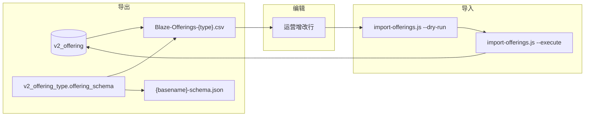

# Offering CSV Import — 设计说明与操作手册

| 项目 | 内容 |
|------|------|
| 状态 | 已实现 |
| 版本 | 1.1 |
| 日期 | 2026-06-04 |
| Cursor 规则 | `.cursor/rules/offering-csv-import.mdc` |
| 相关规则 | `.cursor/rules/database-schema.mdc`、`product-hierarchy.mdc` |
| Status 迁移 | `scripts/design/offering-status-lifecycle.md`、`.cursor/rules/offering-status-lifecycle.mdc` |
| Instance 导入 | `scripts/design/instance-csv-import.md` |
| 旧脚本（deprecated） | `scripts/import-offerings-camp.js`、`scripts/import-offerings-course.js` |

---

## 1. 背景与目标

运营需快速批量维护 **`v2_offering`**（Admin 称 offering / 产品模板；C 端 Session **卡片标题**来自 `v2_offering.name`）。

本流程支持 **Export → 编辑 CSV → Import** 闭环：

1. **Export** — 从数据库按 offering type 导出 CSV + schema manifest
2. **Edit** — 在 Excel / Numbers / Google Sheets 中增改行
3. **Import** — 校验 schema 与 FK 后 upsert 回 `v2_offering`

列由 **`v2_offering_type.offering_schema`** 动态生成；Admin 修改 schema 后须重新 export。

**支持全部 active offering type**（`camp`、`course`、`workshop`、`competition`、`freetrial`、`giftcard`、`careservice` 等），每种 type 单独一个 CSV 文件。



---

## 2. 前置条件

- 项目根目录配置 `.env.local`：`NEXT_PUBLIC_SUPABASE_URL`、`SUPABASE_SERVICE_ROLE_KEY`
- 目标库中已有 active 的 `v2_offering_type` 与 `v2_category`（Learn / Explore / Compete）
- 在本机受信任环境执行（service role 绕过 RLS）
- **无 Admin UI 上传** — 仅 CLI

---

## 3. 数据模型

```text
v2_offering_type (1) ──< (N) v2_offering
                              │
                              └── category_id → v2_category
```

| CSV 列 | DB 字段 | 说明 |
|--------|---------|------|
| `id` | `v2_offering.id` | **新行留空**；修改已有行须保留 |
| `slug` | `v2_offering.slug` | 新行可留空，INSERT 时自动生成 |
| `Title` | `name` | 必填；C 端 Session 卡片标题 |
| `Offering Type` | `v2_offering_type.code` | 须与 `--type` 一致 |
| `Program (tag)` | `v2_category` | 人可读：Learn / Explore / Compete |
| `Status` | `status` | draft / published / suspended / archived — **迁移规则**见 [`offering-status-lifecycle.md`](offering-status-lifecycle.md) |
| `Description for admin` | `description` | 后台备注，**不是** `content\|description` |
| `Image Link` | `poster_url` | Session 缩略图 URL |
| `{group}\|{field}` | `type_config_data` | schema 动态字段 |

- `content.*` / `pricing.*` 写入 `type_config_data` 后 **flatten** 到表列（与 Admin API 一致）
- 写入前 **merge** `v2_category.config_base` → `type_config_data`（category 默认 + 行内值覆盖）

---

## 4. 完整操作方案（SOP）

### 4.1 首次使用或新学期准备

| 步骤 | 操作 | 说明 |
|------|------|------|
| 1 | `node scripts/bootstrap-offering-csv.js --list` | 查看当前 DB 全部 active type |
| 2 | `node scripts/bootstrap-offering-csv.js` | 生成各 type 模板 + 清单 + 设计文档 §10 |
| 3 | 打开 `scripts/templates/offerings-{code}-template.csv` | 了解该 type 必填列 |
| 4 | 按需 `export-offerings.js --type {code}` | 导出已有数据作底稿 |

### 4.2 批量新增 offering

| 步骤 | 操作 |
|------|------|
| 1 | 复制模板行或导出行到新 CSV（**一个 type 一个文件**） |
| 2 | **清空 `id`、`slug`** |
| 3 | 填写 `Title`、`Program (tag)`、该 type 必填 schema 列 |
| 4 | 确保 `Title` 在同 type 下唯一（否则会变成 UPDATE） |
| 5 | `node scripts/import-offerings.js --type {code} --file {path}` | dry-run |
| 6 | 检查控制台与 JSON 报告，`failed = 0` 且行为符合预期（应为 `INSERT`） |
| 7 | 追加 `--execute` 写入 |

### 4.3 批量修改已有 offering

| 步骤 | 操作 |
|------|------|
| 1 | `node scripts/export-offerings.js --type {code} --out {path}.csv` |
| 2 | 在 CSV 中修改字段，**保留 `id`** |
| 3 | 不要改 `Offering Type` |
| 4 | dry-run → 期望 `UPDATE` 或 `UNCHANGED` → `--execute` |

### 4.4 Admin 修改了 Offering Type schema 后

1. 重新 `export-offerings.js --type {code}`（列集会变化）
2. 将旧 CSV 数据迁移到新列（或重新编辑）
3. dry-run 验证；注意 manifest `schema_hash` 变化会有 WARN

### 4.5 与 Session（instance）导入的衔接

**顺序固定：Offerings 先，Instances 后。**

1. 完成本流程，确保 `Title`（= `v2_offering.name`）与 `Program (tag)` 正确
2. 再运行 `import-instances.js`；每行 `Session Title` 须匹配已有 offering 名称 + category

详见 `instance-csv-import.md`。

---

## 5. 命令参考

### 5.1 导出

```bash
node scripts/export-offerings.js --type camp
node scripts/export-offerings.js --type course --out scripts/output/Blaze-Offerings-course.csv
node scripts/export-offerings.js --type camp --status published
node scripts/export-offerings.js --type camp --write-template
```

默认输出：

- CSV：`scripts/output/Blaze-Offerings-{type}.csv`
- Manifest：同目录 `{basename}-schema.json`

### 5.2 导入

```bash
# Dry-run（默认，不写库）
node scripts/import-offerings.js --type camp --file scripts/output/Blaze-Offerings-camp.csv

# 写入
node scripts/import-offerings.js --type camp --file ... --execute

# 仅新增，跳过已存在行
node scripts/import-offerings.js --type camp --file ... --execute --insert-only

# 含 archived 行
node scripts/import-offerings.js --type camp --file ... --execute --include-archived

# 指定 manifest（默认：CSV 同目录 {basename}-schema.json）
node scripts/import-offerings.js --type camp --file ... --manifest path/to-schema.json
```

### 5.3 Bootstrap（全部 active type）

```bash
node scripts/bootstrap-offering-csv.js              # 模板 + 验证 + patch 文档 §10
node scripts/bootstrap-offering-csv.js --templates-only
node scripts/bootstrap-offering-csv.js --verify-only
node scripts/bootstrap-offering-csv.js --list
```

产出：

- `scripts/templates/offerings-{code}-template.csv` + `-schema.json`
- `scripts/output/offering-types-inventory.json` / `.md`
- `scripts/output/bootstrap-offering-csv-{timestamp}.json`

### 5.4 Deprecated 包装

```bash
node scripts/import-offerings-camp.js --dry-run --file ...
# → 转发至 import-offerings.js --type camp
```

`import-offerings-course.js` 的 `--category-only` 已移除。

---

## 6. CSV 列规则

### 6.1 固定列（所有 type）

`id`, `slug`, `Title`, `Offering Type`, `Program (tag)`, `Status`, `Description for admin`, `Image Link`

### 6.2 动态列（schema 驱动）

`offering_schema.fields` 中 `type: object` 的 group 展开为 `{group}|{property}`：

- `content|description` — 产品 Overview（写入 `type_config_data.content.description`）
- `pricing|base_price` — 基准价
- `capacity_meal|base_capacity` — camp 默认容量

顶层非 object 字段（如 `program_lists`）占单列，值为 **JSON 字符串**。

### 6.3 单元格格式

| Schema type | CSV 格式 |
|-------------|----------|
| `text` | 纯文本（避免多余逗号导致列错位） |
| `number` | 数字 |
| `boolean` | `Yes` / `No` |
| `select` | schema 定义的 option 值 |
| `multiselect` | `a\|b\|c` |
| `array` / `object` | JSON，如 `"[50,100,200]"` |

---

## 7. Upsert 规则

| 条件 | 动作 |
|------|------|
| 行有 `id` 且 DB 存在 | UPDATE |
| 行无 `id`，`Title` + type 已存在 | UPDATE |
| 无匹配 | INSERT（auto slug） |
| diff 为空 | UNCHANGED |
| `status=archived` 且未传 `--include-archived` | SKIPPED |

**保护策略**

- 禁止修改已有行的 `offering_type_id`
- offering 已被 `v2_instance` 引用时，禁止修改 `Program (tag)`（`category_id`）
- 已有行 **Status 变更**须符合 [`offering-status-lifecycle.md`](offering-status-lifecycle.md)（迁移矩阵、归档 guard、session 软联动；实现见该文档 §10）
- 文件内 `(id)` 或 `(Title, type)` 重复 → **整批 abort**

**新增行要点：`id` 留空、`slug` 可留空、`Title` 须唯一。**

---

## 8. 导入结果日志

### 8.1 控制台

```
Import offerings → v2_offering
Mode: DRY RUN
Type: course
File: scripts/output/test-offering-course.csv

[2] INSERT CSV Import Test Course Sample (Learn) slug=csv-import-test-course-sample
[3] FAILED: content|description is required

Summary: { insert: 1, update: 0, unchanged: 0, skipped: 0, failed: 1 }
Report: scripts/output/import-offerings-course-2026-06-04T....json
```

- 每行：`[行号] ACTION Title (Program) id=…` 或 `slug=…`
- `failed > 0` 时进程 **exit code 1**
- Schema drift 在导入前以 `[drift] …` WARN 输出

### 8.2 JSON 报告

路径：`scripts/output/import-offerings-{type}-{timestamp}.json`

```json
{
  "mode": "execute",
  "type": "course",
  "file": "scripts/output/test-offering-course.csv",
  "manifest": "scripts/output/test-offering-course-schema.json",
  "offering_type_id": "…",
  "schema_hash": "1b330e1804295c97",
  "drift_warnings": [],
  "summary": { "insert": 1, "update": 0, "unchanged": 0, "skipped": 0, "failed": 0 },
  "results": [
    {
      "row": 2,
      "name": "CSV Import Test Course Sample",
      "program": "Learn",
      "action": "INSERT",
      "id": "617f3486-3942-496a-9fc6-758c902e7d63",
      "slug": "csv-import-test-course-sample",
      "reason": null
    }
  ]
}
```

失败行 `action` 为 `FAILED`，含 `error` 字段。

**说明：** 与 `import-instances.js` 不同，offering 导入**无**单独 `.log` 文本文件，仅 JSON + 控制台。

---

## 9. Schema drift

Import 读取 companion manifest（默认同目录 `{csvBasename}-schema.json`）：

| 情况 | 行为 |
|------|------|
| `schema_hash` 与 DB 不一致 | WARN，以 DB 当前 schema 校验 |
| CSV 缺 DB 必填列 | 该行 FAIL |
| CSV 含未知列 | WARN，忽略 |

---

## 10. 错误码

| Code | 含义 |
|------|------|
| `UNKNOWN_TYPE` | `--type` 在 DB 中不存在或未激活 |
| `UNKNOWN_CATEGORY` | Program (tag) 无法解析 |
| `SCHEMA_VALIDATION` | type_config_data 不符合 offering_schema |
| `SCHEMA_DRIFT` | manifest 与 DB schema 不一致 |
| `DUPLICATE_IN_FILE` | 文件内重复 id/Title |
| `INTEGRITY` | 有 session 引用时改 category |
| `NOT_FOUND` | 指定 id 不存在 |
| `TYPE_MISMATCH` | 行内 Offering Type 与 `--type` 不一致 |

---

## 11. Active offering types

清单以**当前 `.env.local` 连接的 DB** 为准。换环境或修改 schema 后：

```bash
node scripts/bootstrap-offering-csv.js
```

也可查看 `scripts/output/offering-types-inventory.md`。

<!-- OFFERING_TYPES_START -->
<!-- 由 node scripts/bootstrap-offering-csv.js 自动生成，请勿手改 -->

| code | name | offerings | schema columns | verify | template |
|------|------|-----------|----------------|--------|----------|
| careservice | Care Service | 0 | 7 | skipped_no_data | `scripts/templates/offerings-careservice-template.csv` |
| competition | Competitions | 0 | 15 | skipped_no_data | `scripts/templates/offerings-competition-template.csv` |
| freetrial | Free Trial | 0 | 6 | skipped_no_data | `scripts/templates/offerings-freetrial-template.csv` |
| course | Courses | 6 | 14 | pass | `scripts/templates/offerings-course-template.csv` |
| camp | Camps | 24 | 13 | warn | `scripts/templates/offerings-camp-template.csv` |
| giftcard | Gift Card | 0 | 9 | skipped_no_data | `scripts/templates/offerings-giftcard-template.csv` |
| workshop | Workshops | 0 | 14 | skipped_no_data | `scripts/templates/offerings-workshop-template.csv` |

<!-- schema_hash 与列数以当前 DB 为准；换环境后重新运行 bootstrap -->

<!-- OFFERING_TYPES_END -->

---

## 12. 文件清单

| 路径 | 说明 |
|------|------|
| `.cursor/rules/offering-csv-import.mdc` | Cursor / AI 规则摘要 |
| `scripts/lib/import-offerings-common.js` | 共享逻辑 |
| `scripts/export-offerings.js` | 导出 CLI |
| `scripts/import-offerings.js` | 导入 CLI |
| `scripts/bootstrap-offering-csv.js` | 全 type bootstrap |
| `scripts/templates/offerings-{type}-template.csv` | 空模板 |
| `scripts/output/Blaze-Offerings-{type}.csv` | 默认导出路径 |
| `scripts/output/import-offerings-{type}-*.json` | 导入 JSON 报告 |
| `scripts/output/offering-types-inventory.json` | active type 清单 |
| `src/app/admin/guide/guide-content.ts` | Admin Guide 操作说明（Web UI） |
