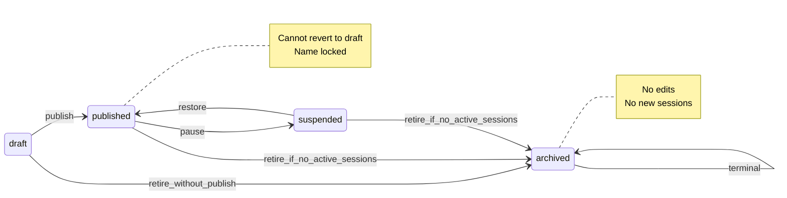
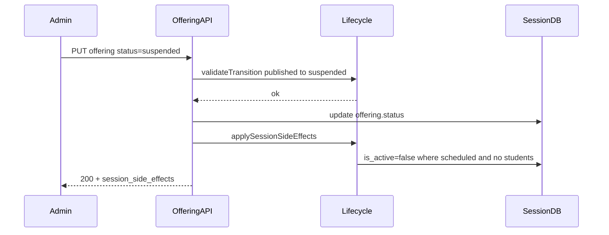

# Offering Status Lifecycle — 设计说明

| 项目 | 内容 |
|------|------|
| 状态 | 规范已定；代码实现见 §10（待后续 PR） |
| 版本 | 1.0 |
| 日期 | 2026-06-05 |
| Cursor 规则 | `.cursor/rules/offering-status-lifecycle.mdc` |
| 相关规则 | `.cursor/rules/database-schema.mdc`、`product-hierarchy.mdc`、`offering-csv-import.mdc` |
| Offering CSV | `scripts/design/offering-csv-import.md` |
| Instance CSV | `scripts/design/instance-csv-import.md` |

---

## 1. 背景与目标

Admin 维护 **`v2_offering` / `v3_offering`**（Session 模板层）时需明确：

1. **Offering 四态**（`draft` / `published` / `suspended` / `archived`）的语义与允许迁移路径
2. 状态变更对关联 **`v2_instance` / `v3_session`**（Web **Session**）的影响
3. Admin UI、REST API、CSV 导入三处规则一致

**适用表**（经 `@/lib/catalog-db.ts`）：

| Admin 术语 | V2 表 | V3 表 |
|------------|-------|-------|
| offering | `v2_offering` | `v3_offering` |
| session | `v2_instance` | `v3_session` |

**不在范围**：

- 不自动修改 `instance_enrollments` 状态或触发退款
- 不删除 session 行（DELETE offering 仍要求无 session，见现有 API）

**实现状态（2026-06-05）**：

| 能力 | 现状 |
|------|------|
| C 端仅展示 `published` offering 的 session | 已实现 |
| 仅 `published` offering 可新建 session | 已实现 |
| `published → draft` 禁止；非 draft 不可改名 | 已实现（Admin UI + PUT API） |
| 完整迁移矩阵 + session 软联动 + 归档 guard | **本文档为 source of truth；代码待 §10** |



---

## 2. Offering 状态语义

| Status | Admin 可编辑 | C 端 catalog | 可新建 session | Name 可改 |
|--------|-------------|--------------|----------------|-----------|
| `draft` | 是 | 否 | 否 | 是 |
| `published` | 是（name 除外） | 是 | 是 | 否 |
| `suspended` | 是（name 除外） | 否 | 否 | 否 |
| `archived` | **否** | 否 | 否 | 否 |

**说明**：

- **draft**：模板编辑中；不可被 C 端或 session 创建 API 使用。
- **published**：唯一「上线」态；C 端 catalog / 详情 / 推荐均要求 `offering.status === 'published'`。
- **suspended**：临时下线；保留数据与历史报名，C 端不可见，不可新建 session。
- **archived**：终态；仅列表/审计只读，不可再编辑或迁移到其他态。

Session 自身状态（与 offering 独立）：`scheduled` | `ongoing` | `completed` | `cancelled`，另有 `is_active` 布尔列（见 `database-schema.mdc`）。

---

## 3. 状态迁移矩阵

### 3.1 允许迁移

| From \\ To | draft | published | suspended | archived |
|------------|-------|-----------|-----------|----------|
| **draft** | — | 允许¹ | 允许 | 允许² |
| **published** | **禁止** | — | 允许¹ | 允许² |
| **suspended** | **禁止** | 允许 | — | 允许² |
| **archived** | **禁止** | **禁止** | **禁止** | — |

¹ **需 Admin 英文确认**（见 §5）：

- `draft → published`
- `* → suspended`（自 `published` 或 `draft`）

² **归档前置条件**：该 offering 下 **不存在** `status IN ('scheduled', 'ongoing')` 的 session。  
若存在 → HTTP 400：

```text
Cannot archive offering while scheduled or ongoing sessions exist. Complete or cancel those sessions first.
```

`completed` / `cancelled` session **不阻止**归档。

### 3.2 禁止迁移（HTTP 400，英文 message）

| 迁移 | Error message |
|------|---------------|
| `published → draft` | `Published offerings cannot be reverted to draft.` |
| `suspended → draft` | `Suspended offerings cannot be reverted to draft.` |
| `archived → *` | `Archived offerings cannot change status.` |
| 任意非法组合 | `Invalid offering status transition from '{from}' to '{to}'.` |

### 3.3 Name 与 slug

| 规则 | Error message |
|------|---------------|
| 仅 **draft** 可改 `name` | `Cannot rename offering after it has left draft status. Only draft offerings allow name changes.` |
| `slug` | 遵循现有 PUT 校验；非 draft 建议 UI 只读（与 name 一致策略） |

---

## 4. Session 联动（软联动）

**原则**：

1. **不**因 offering 状态自动将 session `status` 设为 `cancelled`（除非 Admin 单独操作 session）。
2. 已有报名（`current_students > 0`）的 session **不**自动改 `is_active`。
3. C 端可见性 primarily 由 `offering.status === 'published'` 过滤（现有 public API）；session 侧 `is_active` 为第二层 gate。

### 4.1 按迁移类型的 side effects

| Offering 迁移 | Session 操作 | C 端行为 |
|---------------|--------------|----------|
| → `published`（自 `draft`） | 无 | 可新建 session；已有 `scheduled` + `is_active` 可见 |
| → `suspended` | 见 §4.2 | 全部隐藏（offering 非 published） |
| → `published`（自 `suspended`） | 见 §4.3 | 恢复可见 |
| → `archived` | 无额外 cascade（§3 已保证无 active session） | 永久隐藏 |
| `ongoing` / `completed` / `cancelled` | **永不**因 offering 状态自动修改 | suspend 期间：Admin/Coach 可见；C 端 catalog 不可见 |

### 4.2 Suspend：`published` 或 `draft` → `suspended`

对满足 **全部** 条件的 session 行：

```text
offering_id = {id}
AND status = 'scheduled'
AND current_students = 0
AND is_active = true
```

执行：

1. `is_active = false`
2. 在 `instance_data_ext` 写入标记（便于恢复时识别）：

```json
{ "_auto_hidden_by_offering_status": "suspended" }
```

**不修改**：`ongoing`、`completed`、`cancelled`；以及 `current_students > 0` 的任何 session。

### 4.3 Restore：`suspended` → `published`

对满足 **全部** 条件的 session 行：

```text
offering_id = {id}
AND status = 'scheduled'
AND current_students = 0
AND is_active = false
AND instance_data_ext._auto_hidden_by_offering_status = 'suspended'
```

执行：

1. `is_active = true`
2. 从 `instance_data_ext` **删除** `_auto_hidden_by_offering_status`

**不恢复**：Admin 手动设为 `is_active=false` 且 **无** 上述标记的 session。

### 4.4 报名与 C 端详情

- `GET /api/public/instance-v2/[id]`、`GET /api/public/instances-v2`：offering 非 `published` → session 不可见（404 或 catalog 过滤）。
- **Suspend / archive 不取消** `instance_enrollments`；家长历史、教练端、Admin 报表仍保留 DB 记录。
- Suspend 期间，已报名 session 的 C 端详情不可访问；运营需通过 Admin/Coach 处理。

### 4.5 Side effect 响应摘要（API 可选字段）

PUT offering 成功且 status 变更时，响应可附带：

```json
{
  "session_side_effects": {
    "deactivated": 3,
    "restored": 0
  }
}
```

---

## 5. Admin UI（`/admin/blaze/offerings`）

**文件**：`src/app/admin/blaze/offerings/page.tsx`

| 行为 | 规则 |
|------|------|
| 打开编辑 | `archived` → toast 禁止（已有） |
| Name | 仅 `draft` 可编辑（已有） |
| Status Select | 选项 = §3 允许的目标态（基于 **打开对话框时的** `editingOffering.status`） |
| 保存确认（英文） | 见下表 |

| 迁移 | Title | Description（摘要） |
|------|-------|---------------------|
| `draft → published` | Publish this offering? | Name locked afterward; cannot revert to draft; visible when creating sessions. |
| `* → suspended` | Suspend this offering? | Hidden from catalog; scheduled sessions with no enrollments will be deactivated. |
| `* → archived` | Archive this offering? | Irreversible; only allowed when no scheduled or ongoing sessions exist. |

---

## 6. API enforcement

**路由**：`PUT /api/admin/offering/v2/[id]`（`src/app/api/admin/offering/v2/[id]/route.ts`）

**流程**：

```text
1. Load existing (id, status, name, …)
2. validateOfferingStatusTransition(from, to)     // 共享模块
3. if to === 'archived': assertCanArchiveOffering(offeringId)
4. if name change && from !== 'draft': reject
5. UPDATE offering
6. if status changed: applyOfferingStatusSessionSideEffects(offeringId, from, to)
7. Return offering (+ optional session_side_effects)
```

**新建 session**：`POST /api/admin/instance/v2` — 保持仅 `offering.status === 'published'`（已有）。

**C 端 public API**：保持 `offering.status === 'published'` 过滤（已有）。

**共享模块（§10 实现）**：`src/lib/offering-status-lifecycle.ts`

| 导出 | 职责 |
|------|------|
| `validateOfferingStatusTransition(from, to)` | 矩阵校验；抛/返标准 error message |
| `assertCanArchiveOffering(supabase, offeringId)` | 检查无 scheduled/ongoing session |
| `applyOfferingStatusSessionSideEffects(supabase, offeringId, from, to)` | §4 软联动 |

---

## 7. CSV 导入约定

**脚本**：`scripts/lib/import-offerings-common.js`

| 场景 | 规则 |
|------|------|
| 新行 INSERT | 任意合法 status；**不**触发 session side effects |
| 已有行 UPDATE 且 **status 未变** | 常规 upsert |
| 已有行 UPDATE 且 **status 变更** | 与 API 相同：`validateTransition` + 归档 guard；`--execute` 时执行 session side effects |
| Dry-run | 报告将发生的 transition / side effects；**不**写 session |
| `status=archived` 且无 `--include-archived` | SKIPPED（已有） |
| 批量 `draft → published` | SOP 建议加 `--confirm-publish`（后续脚本 flag）；单次 import 前人工 review dry-run |

**注意**：`--include-archived` 用于 export 回写场景；**禁止**用 import 批量 archive 生产数据而不经 dry-run 与 session 检查。

---

## 8. 日志与错误码

**日志前缀**：

```text
[v2_offering] [offering-lifecycle] …
[v3_offering] [offering-lifecycle] …
```

（表名随 `catalogTables.offering`。）

**HTTP 400 标准 errors**（完整列表）：

| Code / 场景 | Message |
|-------------|---------|
| 非法迁移 | `Invalid offering status transition from '{from}' to '{to}'.` |
| published → draft | `Published offerings cannot be reverted to draft.` |
| suspended → draft | `Suspended offerings cannot be reverted to draft.` |
| archived 变更 | `Archived offerings cannot change status.` |
| 归档 blocked | `Cannot archive offering while scheduled or ongoing sessions exist. Complete or cancel those sessions first.` |
| 改名 blocked | `Cannot rename offering after it has left draft status. Only draft offerings allow name changes.` |

---

## 9. 相关文档

| 文档 | 关系 |
|------|------|
| `.cursor/rules/database-schema.mdc` | Status enum 定义 |
| `.cursor/rules/product-hierarchy.mdc` | Web vs Admin 术语 |
| `scripts/design/offering-csv-import.md` | `Status` CSV 列 |
| `scripts/design/instance-csv-import.md` | Session 导入（依赖 published offering） |

---

## 10. 后续实现清单（单独 PR）

> **当前 PR 仅交付本文档与 Cursor rule**；下列代码变更待实现。

1. **`src/lib/offering-status-lifecycle.ts`** — 导出 §6 三个函数 + 常量 `OFFERING_STATUSES`
2. **`scripts/lib/offering-status-lifecycle.js`** — Node 侧复用（或从 TS 编译；import 脚本用）
3. **`PUT /api/admin/offering/v2/[id]`** — 接入 lifecycle 模块；返回 `session_side_effects`
4. **`src/app/admin/blaze/offerings/page.tsx`** — Status Select 过滤；suspend/archive 确认
5. **`scripts/lib/import-offerings-common.js`** — status 变更时调用同一套校验与 side effects
6. **可选**：`npm run lint` 无新增 error



---

## 11. 运营 SOP 速查

| 目标 | 操作 |
|------|------|
| 上新 offering | draft → 填配置 → **Publish**（确认）→ import/create sessions |
| 临时下架 | published → **Suspend**（确认）；无报名 scheduled session 自动 deactivate |
| 重新上架 | suspended → **Published**；带标记的 session 自动 restore |
| 永久退役 | 先将 scheduled/ongoing session 完成或 cancel → offering → **Archive** |
| 误建 draft offering | draft → **Archive**（无需 publish） |
