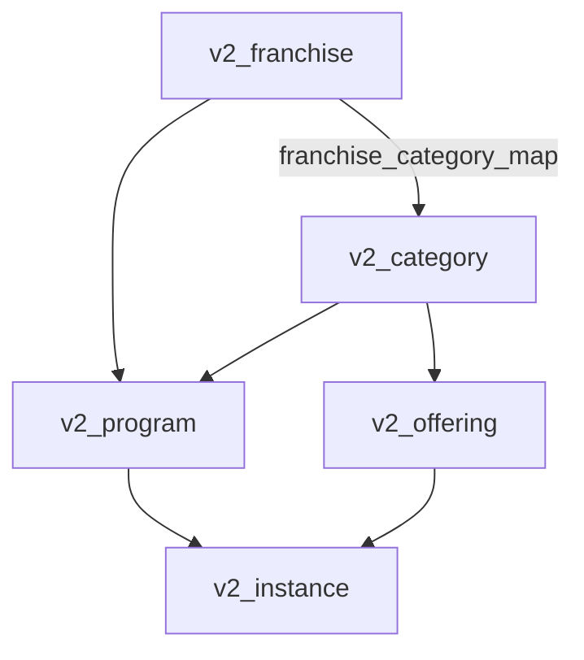
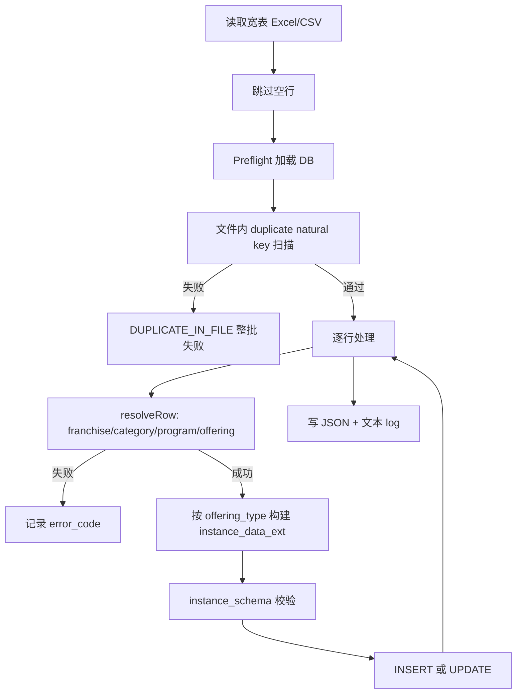
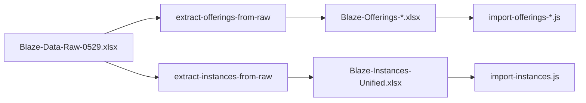

# Unified Instance Import — 设计说明

| 项目 | 内容 |
|------|------|
| 状态 | 已实现（`import-instances.js` + `lib/import-instances-common.js`） |
| 版本 | 1.0 |
| 日期 | 2026-05-29 |
| 相关规则 | `.cursor/rules/database-schema.mdc` |
| 现有脚本（保留，不删除） | `scripts/import-instances-camp.js`、`scripts/import-instances-course.js` |
| 统一入口 | `scripts/import-instances.js`、`scripts/lib/import-instances-common.js` |

---

## 1. 背景与目标

### 1.1 问题

当前 camp 与 course 的 instance 导入各有一套脚本，列格式不同，`instance_data_ext` 构建逻辑分叉，约 70% 代码重复。运营需维护多张表，且难以在同一次操作中混合导入不同类型 session。

### 1.2 目标

- **一张宽表**（Excel/CSV）容纳 camp + course 全部列；每行按 offering type 自动路由字段映射。
- **Admin 运维语义**：每行 instance 明确归属 `franchise → category → program → offering`。
- **幂等、可审计**：支持重复执行；产出详细操作 log（控制台 + JSON + 文本）。
- **向后兼容**：保留现有 `import-instances-camp.js` / `import-instances-course.js`，后续可改为薄包装调用统一入口。

### 1.3 非目标（本期不做）

- 不在 `v2_offering_type.instance_schema` 中增加 `import_key` 元数据（二期 schema 驱动导入）。
- 不做 Admin UI 上传导入。
- 不删除、不替换现有导入脚本文件（直至统一脚本验证通过）。
- **Instance 导入不包含 `Image Link`**（已确认；图片仅通过 Offerings 导入维护，见 §3.7）。
---

## 2. 数据模型与 Admin 层级

与 V2 schema 及 Admin 后台操作顺序一致：



**C-end 命名对照**

| C-end | Admin / DB |
|-------|------------|
| Location | `v2_franchise` |
| Program | `v2_category`（Learn / Explore / Compete） |
| Activity | `v2_program`（如 2026 Summer Camps） |
| Session | `v2_offering`（模板）+ `v2_instance`（具体排期） |

**写入 `v2_instance` 的外键**

| 字段 | 来源 |
|------|------|
| `program_id` | 解析自 franchise + category + Activity (program) |
| `offering_id` | 解析自 Session Title + category（`offering.category_id` 须与 program 一致） |
| `campus_id` | 可选；同 franchise 下 campus 模糊匹配 |

**完整性校验（写入前必须通过）**

1. `program.franchise_id` = 当前 franchise
2. `program.category_id` = CSV 中 `Programs (category)` 解析结果
3. `offering.category_id` = `program.category_id`
4. franchise 已订阅该 category（`v2_franchise_category_map`；program 存在即通常已满足）

**示例（Bellevue + Compete + 2026 Summer Camps）**

```text
Location Code:       bellevue
Programs (category): compete
Activity (program):  2026 Summer Camps
Session Title:       2-Week Full Day: Competitive Robotics Fundamentals with VEX IQ (Rising Grades 3-4)
```

解析链：`bellevue` → franchise → `compete` → category → 在 Bellevue 且 `category_id=compete` 的 programs 中匹配 `2026 Summer Camps` → `program_id`；再按 Session Title + compete 匹配 offering → `offering_id`。

---

## 3. 宽表列设计

### 3.1 设计原则

- **宽表**：camp 与 course 列并存；每行只填与该行 offering type 相关的列，其余留空。
- **`Programs (category)` 必填**：与 Admin「先选 franchise → category → program」一致；避免同一 franchise 下 learn/explore/compete 各有同名 activity 时挂错 program。
- **Offering type 自动识别**：`Session Title` → `v2_offering` → `offering_type.code`（`camp` / `course`）。可选列 `Offering Type (tag)` 用于交叉校验。

### 3.2 身份列（所有有效行必填）

| 列名 | 说明 | 别名（HEADER_ALIASES） |
|------|------|------------------------|
| Location Code | franchise `code`，如 `bellevue` | `Location ID`（指 code，非 UUID） |
| Programs (category) | Learn / Explore / Compete | `Program (category)` |
| Activity (program) | `v2_program.display_name`，限定 franchise+category | `Activity` |
| Session Title | `v2_offering.name` | `Title` |
| Campus | 校区名或地址 | — |
| Start Date | 开始日期 | 支持 `YYYY-MM-DD`、`M/D/YYYY`、Excel 序列号 |
| End Date | 结束日期 | 同上 |
| Price Override | 实例售价覆盖；Camp / Course 均有 | 来自 raw `Price` |
| Status | `scheduled` / `ongoing` / `completed` / `cancelled` | — |
| Is Active | Yes/No | — |
| Featured | Yes/No | — |
| Amilia Link | 外链报名 URL | — |
| Notes | 备注 | — |

### 3.3 Camp 专用列（course 行留空）

| 列名 |
|------|
| Start Time, End Time |
| Min Age, Max Age |
| Max Campers |
| Meal Provided, Camp Shirt Provided, After Care Available |

写入：`instance_data_ext`（`schedule`、`capacity_price`、`camp_services`、`age_range`、`additional.special_needs`）；`v2_instance` 扁平列（`start_date`、`max_students`、`price_override` 等）。

### 3.4 Course 专用列（camp 行留空）

| 列名 |
|------|
| Classes start on which days each week |
| Target Grade |

写入：`instance_data_ext`（`schedule` 含 `days_of_week`、`audience.target_grades`、`age_range`）；`v2_instance.days_of_week`。

### 3.5 Camp vs Course 差异摘要

| 维度 | Camp | Course |
|------|------|--------|
| 容量/价格 | Max Campers + **Price Override**（宽表） | **Price Override**（宽表）；Max Campers 通常为空 |
| 服务 | Meal / Shirt / After Care | 无 |
| 排期 | 日期 + 时间 | 含每周上课日；Start Time 可为日期 |
| 受众 | Min/Max Age 可选 | Min/Max Age 必填 + Target Grade |
| `instance_data_ext` | `camp_services`, `capacity_price` | `audience.target_grades`；有 `Price Override` 时写 `capacity_price` |
| `days_of_week` 列 | 不写 | 写 `v2_instance.days_of_week` |

### 3.6 模板文件（计划）

- 参考：`scripts/templates/instances-camp-template.csv`
- 新增：`scripts/templates/instances-unified-template.csv`（身份列 + camp 列 + course 列）

### 3.7 Offering 图片（Image Link）— 明确不在 Instance 导入范围

**已确认：Instance 宽表与 `import-instances.js` 均不包含 `Image Link`，不读取、不写入 `v2_offering.poster_url`。**

C-end Session 卡片缩略图来自 **`v2_offering.poster_url`**（offering 级字段），不是 `v2_instance` 字段：

| 项目 | 说明 |
|------|------|
| **数据归属** | `poster_url` 写在 **offering 模板**上；同一 `Session Title` 下所有 instance 共用该图 |
| **导入入口** | **Offerings 导入**（与 Instance 导入分离） |
| **源文件** | `Blaze-Offerings-Camp.xlsx`、`Blaze-Offerings-Course.xlsx` |
| **脚本** | `scripts/import-offerings-camp.js`、`scripts/import-offerings-course.js`（保留，不删除） |
| **列名** | `Image Link`（别名 `image link`） |
| **写入** | `v2_offering.poster_url`（经 `normalizePosterUrl` 规范化 URL） |

**Offerings 表典型列（与 Instance 宽表无关）**

| 列 | 写入 |
|----|------|
| Title | `v2_offering.name`（= Instance 表的 Session Title） |
| Image Link | `v2_offering.poster_url` |
| Overview / Target Students / … | `type_config_data` + 扁平列 |
| Program （tag） | `v2_offering.category_id` |
| Offering Type （tag） | `v2_offering_type` |

**Instance 导入前置条件**

1. 先完成 Offerings 导入（含 `Image Link`），或 Admin 中已配置 `poster_url`
2. Instance 导入仅解析已有 offering（`Session Title` + category），**不读取、不更新** `poster_url`
3. 若 offering 不存在 → `OFFERING_NOT_FOUND`；若 `poster_url` 为空 → instance 导入仍可成功，C-end 可能无图（属 offering 数据问题，非 instance 导入错误）

**运营推荐顺序**

```text
1. Blaze-Offerings-{Camp|Course}.xlsx  →  import-offerings-*.js   →  v2_offering（含 poster_url / Image Link）
2. Blaze-Instances*.xlsx              →  import-instances.js     →  v2_instance（无 Image Link）
```

**同一工作簿多 Sheet（可选，本期不实现）**

若运营希望一个 Excel 文件管理全部数据，可使用 **两个 Sheet**（`Offerings` + `Instances`），仍由 **不同脚本** 分别读取；Instance Sheet 不出现 Image Link 列。

---

## 4. 命名约定：ID vs Display Name

**人工维护宽表：使用可读标签，不用 UUID。**

| 实体 | 表中填写 | 匹配 DB 字段 |
|------|----------|--------------|
| Location | **`bellevue`**（franchise `code`） | `v2_franchise.code`；`Bellevue` 可作 name 别名 |
| Category | **Compete / Learn / Explore** | `v2_category.name` 或 `display_name` |
| Program | **2026 Summer Camps** | `v2_program.display_name`（回退 `name`） |
| Offering | Session Title 全文 | `v2_offering.name` |
| Offering 图片 | **不在 Instance 表填写** | `v2_offering.poster_url`（见 `import-offerings-*.js` + `Image Link`） |
| Campus | 地址或 display_name | `v2_campus` 模糊匹配 |

导入时 `preflight` 加载 lookup 表；**写入 DB 使用解析得到的 UUID**（`program_id`、`offering_id`、`campus_id`）。

可选高级列（非默认）：`Program ID`、`Offering ID`（UUID），用于自动化回灌。

失败时应列出 **Available** 选项，例如：

```text
Activity "2028 Summer Camps" not found under compete @ bellevue. Available: 2026 Summer Camps
```

---

## 5. 导入流程



### 5.1 Preflight

一次加载：

- `v2_offering_type`（camp、course 的 `instance_schema`）
- `v2_franchise`、`v2_category`、`v2_program`、`v2_offering`、`v2_campus`
- 已有 `v2_instance`（构建 natural key 索引）

索引：

- `franchiseByCode` + `franchiseByName`（code/name 双索引）
- `categoriesByKey`
- `programsByFranchise`（含 `category_id`）
- `offeringsByName`（按 category 过滤）
- `instanceByNaturalKey`

### 5.2 resolveRow（三步定位）

1. **Franchise**：`Location Code` → `v2_franchise`
2. **Category + Program**：`Programs (category)` → category；在该 franchise 且 `category_id` 匹配的程序中查找 `Activity (program)` → `v2_program`
   - 若 activity 未匹配且该 category 下**仅有唯一 program**，可使用 sole-program fallback（打 warn）
3. **Offering**：`Session Title` + `category_id` → `v2_offering`

### 5.3 Offering type 路由

```javascript
// 设计示意（非实现代码）
const BUILDERS = {
  camp: buildCampInstanceDataExt,
  course: buildCourseInstanceDataExt,
}
```

流程：

1. 合并 `category.config_base` + 行级 `instance_data_ext`
2. `validateInstanceSchema(offeringType.instance_schema.fields, mergedExt)`
3. `deriveRowFields` → `v2_instance` 扁平列
4. `derivePortalFields(offering)` → `is_course_type`、`portal_service_role`

未知 `offering_type.code` → `FAILED`，不静默跳过。

### 5.4 校验与合并

- 遵循 `database-schema.mdc`：`instance_data_ext` 由 `instance_schema` 驱动；嵌套组（`schedule`、`capacity_price`）派生 `start_date`、`max_students` 等列。
- Offering 默认须 `published`；draft 策略见 §6.3。

---

## 6. 错误处理、重复项与幂等

### 6.1 Natural Key（幂等键）

```text
location | category | activity | sessionTitle | startDate | campus
```

| 场景 | 行为 |
|------|------|
| DB 已有同键 | **UPDATE** |
| DB 无同键 | **INSERT** |
| 同次 execute 内第二行同键 | 第一行 INSERT 后更新内存索引 → 第二行 **UPDATE** |

### 6.2 文件内重复

- **Preflight 扫描**：同 natural key 多行 → 默认 **`DUPLICATE_IN_FILE`**，execute 前失败，报行号列表。
- 可选 `--allow-file-duplicates`：保留最后一行，其余 `SKIPPED_DUPLICATE`。

### 6.3 UPDATE 保护字段

| 字段 | 策略 |
|------|------|
| `current_students` | **不覆盖**（保留报名数） |
| `id`, `created_at` | 不写入 update payload |

可选：数据无变化时 `UNCHANGED`，跳过写库。

### 6.4 Draft Offering

| 模式 | 行为 |
|------|------|
| dry-run | `DRAFT_BLOCKED` + 警告汇总 |
| `--publish-referenced-offerings` + execute | 先 publish 再 insert |
| `--allow-draft-offering` | 允许 draft offering |

### 6.5 error_code 一览

| error_code | 说明 |
|------------|------|
| `UNKNOWN_LOCATION` | Location 无匹配 |
| `UNKNOWN_CATEGORY` | Category 无效 |
| `PROGRAM_NOT_FOUND` | franchise+category 下无 Activity |
| `OFFERING_NOT_FOUND` | Session Title 不存在或 category 不符 |
| `OFFERING_AMBIGUOUS` | 同名 offering 跨 category |
| `OFFERING_DRAFT` | offering 非 published |
| `CAMPUS_NOT_FOUND` | Campus 无匹配 |
| `SCHEMA_VALIDATION` | instance_schema 校验失败 |
| `DUPLICATE_IN_FILE` | 文件内 natural key 重复 |
| `PARSE_ERROR` | 日期/时间/Yes-No 格式错误 |
| `INTEGRITY` | offering.category ≠ program.category |

### 6.6 执行模式

| CLI | 行为 |
|-----|------|
| `--dry-run`（默认） | 不写入；完整校验与 log |
| `--execute` | 写入 `v2_instance` |
| `--fail-fast` | 首条 FAILED 即停止 |
| （默认） | 逐行继续；`failed > 0` 时 `exit 1` |
| `--type all\|camp\|course` | 过滤 offering type |
| `--allow-file-duplicates` | 允许文件内重复键 |
| `--allow-draft-offering` | 允许 draft offering |
| `--publish-referenced-offerings` | execute 时 publish 引用 offering |
| `--replace-all` | execute 前 **DELETE 全部** `v2_instance`，再纯 INSERT（隐含 `--insert-only`） |
| `--insert-only` | 跳过 UPDATE，仅 INSERT（与 `--replace-all` 联用做全量重建） |
| `--audit` | 仅运行 category 一致性审计后退出 |

### 6.6.1 UPSERT 与 orphan 行

默认 UPSERT（natural key 匹配则 UPDATE）**不会删除** CSV 未覆盖的旧 instance。若库中已有脏数据或与 CSV 重复的行，会出现：

- instance 总数 > CSV 行数
- `offering.category_id ≠ program.category_id`（Admin API 报错）

**全量重建**（无 enrollment 时）：`--execute --replace-all --allow-file-duplicates`，使库内 instance **仅来自 CSV**。

### 6.6.2 文件内重复 natural key

`Blaze-Instances-Unified.csv` 中 rows 219–220 等同 session 不同 Amilia link。使用 `--allow-file-duplicates` 保留**最后一行**，其余 `SKIPPED_DUPLICATE`。

### 6.6.3 完整性审计

```bash
node scripts/audit-instances-integrity.js
# 或
node scripts/import-instances.js --audit
```

导入前后自动审计写入 report 的 `audit_before` / `audit_after`。

### 6.7 空行

- 身份列全空 → `SKIPPED_EMPTY`（不计 failed）
- 身份列部分缺失 → `PARSE_ERROR`

---

## 7. 详细数据操作 Log

每次运行必须产出可审计记录，分三层：

### 7.1 控制台

```text
[row] ACTION | offering_type | location/category/activity | sessionTitle | startDate | instance_id | 备注
```

示例：

```text
[12] UPDATE | camp | bellevue/compete/2026 Summer Camps | 2-Week Full Day… | 2026-07-06 | id=abc… | price_override 1750→1800
[14] FAILED | camp | bellevue/compete | … | PROGRAM_NOT_FOUND | Available: 2026 Summer Camps
```

结束打印 Summary（各 action 计数 + 耗时）。

### 7.2 JSON 报告（必写）

路径：`scripts/output/import-instances-{timestamp}.json`

结构：

- **`meta`**：时间、mode、源文件、处理/跳过行数、CLI 参数、supabase_url（无 secrets）
- **`preflight`**：加载实体数量统计
- **`summary`**：insert / update / unchanged / skipped / failed / draft_blocked / duplicate_in_file
- **`duplicate_in_file`**：重复键及行号
- **`results[]`** 每行：
  - `row`, `action`, `offering_type`, `natural_key`
  - `input`（原始关键列）
  - `resolved`（名称 + UUID）
  - `instance_id`
  - `db_before` / `db_after` / `changes`（UPDATE 字段级 diff）
  - `error_code`, `error`, `hint`

dry-run：`db_after` 为拟写入内容；INSERT 时 `instance_id` 为 null。

### 7.3 文本 Log（默认开启）

路径：`scripts/output/import-instances-{timestamp}.log`

- 控制台内容
- 失败明细（按 error_code 分组）
- UPDATE 变更汇总

### 7.4 规则

- 每次运行独立落盘，不覆盖历史
- `failed > 0` 时控制台醒目提示 log 路径
- 不记录 service role key 等 secrets

---

## 8. 计划文件结构

```
scripts/
  import-instances.js              # 统一入口
  audit-instances-integrity.js     # category 一致性审计
  import-instances-camp.js         # 保留；未来可改为薄包装
  import-instances-course.js       # 保留；未来可改为薄包装
  import-offerings-camp.js         # 保留；Offering 含 Image Link → poster_url
  import-offerings-course.js       # 保留；Offering 含 Image Link → poster_url
  lib/
    import-instances-common.js     # 公共逻辑（新建）
  templates/
    instances-camp-template.csv    # 保留
    instances-unified-template.csv # 新建
  design/
    unified-instance-import.md     # 本文档
  extract-instances-from-raw.js    # 计划：Raw → Unified Instance 宽表（新建，非 import）
  output/
    import-instances-*.json        # 运行产物
    import-instances-*.log
```

**CLI**

```bash
node scripts/import-instances.js --dry-run [--file <path>] [--type all|camp|course]
node scripts/import-instances.js --execute [--file <path>] [--fail-fast] [--allow-draft-offering] [--publish-referenced-offerings]

# 全量重建（无 enrollment 时）
node scripts/import-instances.js --execute --replace-all --allow-file-duplicates \
  --file Blaze/Blaze-Instances-Unified.csv

node scripts/audit-instances-integrity.js
```

默认源文件：`Blaze-Instances.xlsx`（OneDrive Blaze 目录）；亦可通过 `--file` 指定现有 `Blaze-Instances-Camps.xlsx` 等。

---

## 11. 从原始宽表提取 Instance 数据（`Blaze-Data-Raw-0529.xlsx`）

运营侧维护一张 **Raw Data** 全量表（含 offering 文案 + 排期 + 标签）。需经 **提取/转换** 步骤生成 Unified Instance Import 宽表，再交给 `import-instances.js`。**Image Link 走 Offerings 提取，不进 Instance 表**（§3.7）。

### 11.1 原始文件结构（实测 `Blaze-Data-Raw-0529.xlsx`）

单 Sheet `Raw Data`，约 **256 条有效行**（总 1000 行含空行）。

| 原始列 | 示例 | 用途 |
|--------|------|------|
| Title | `2-Week Full Day: Competitive Robotics… (Rising Grades 3-4)` | → **Session Title** |
| Image Link | `https://…` | → **仅 Offerings 提取**（§11.6） |
| Amilia Link | `https://app.amilia.com/…` | → **Amilia Link** |
| Location | `Bellevue` / `Chess4Life Bellevue` / … | → **Campus**（原文，不解析）；另经别名表 → **Location Code** |
| Start Date / End Date | Excel 序列号 `46209` | → **Start/End Date**（转 `YYYY-MM-DD`） |
| Time | `Weekdays, 9:00 AM - 3:00 PM` | → 解析 **Start Time / End Time**；course 另解析 **上课日** |
| Price | `1750` / `390` | → **Price Override**（Camp / Course 均写入宽表） |
| Overview / Target Students / Learning Outcome | 长文本 | → **仅 Offerings 提取** |
| Tag: Explore/Learn/Compete | `Explore` / `Compete` / `Learn` | → **Programs (category)** |
| Tag: Camp/Course/Workshop/Competition | `Camp` / `Course` | **过滤** + 推导 Activity (program) |
| IsFeatured | `Yes` / 空 | → **Featured**（空 → No） |

**原始表中没有、Instance 导入必需的列（需推导或默认）**

| Unified 列 | 推导策略 |
|------------|----------|
| Activity (program) | 由 offering type 标签推导（见 §11.3） |
| Campus | 原始 `Location` 列**原文**写入，不做别名或 code 转换 |
| Status | 默认 `scheduled` |
| Is Active | 默认 `Yes` |
| Min Age / Max Age | 从 **Title** 解析 `Rising Grades X-Y` / `Ages X-Y`（约 210/256 行可解析） |
| Max Campers | 原始表无；留空（使用 offering 默认容量） |
| Meal / Shirt / After Care | 原始表无；Camp 默认 `Yes/Yes/No` 或留空用 offering 默认 |
| Classes start on which days… | 从 **Time** 解析（仅 Course） |
| Target Grade | 从 **Title** 解析 `Rising Grades`（仅 Course） |

### 11.2 提取流水线（推荐三阶段）



1. **Offerings 提取**（按 `Title` + category + type 去重）→ `Blaze-Offerings-Camp.xlsx` / `Course.xlsx` → 现有 `import-offerings-*.js`
2. **Instances 提取**（一行 raw = 一行 instance）→ `Blaze-Instances-Unified.xlsx` → 计划 `import-instances.js`
3. **顺序**：先 offerings 入库，再 instances

计划新增转换脚本（仅设计）：`scripts/extract-instances-from-raw.js`（读 Raw，写 Unified Instance 宽表 CSV/XLSX）。

### 11.3 行过滤与 Activity (program) 推导

**过滤**

```text
保留: Tag: Camp/Course/... ∈ { Camp, Course }
跳过: Workshop, Competition（本期无数据；若出现写入 extract log 为 SKIPPED_UNSUPPORTED_TYPE）
```

**Activity (program) 推导规则**（与 DB 中 `v2_program.display_name` 对齐）

| Tag: Camp/Course | → Activity (program) |
|------------------|----------------------|
| Camp | `2026 Summer Camps` |
| Course | `2026 Summer Courses` |

在 **Location Code + Programs (category) + Activity** 三维下，导入器定位具体 `v2_program`（如 Bellevue + Compete + `2026 Summer Camps`）。

### 11.4 Location 别名 → Location Code

原始 `Location` 须映射为 `v2_franchise.code`：

| 原始 Location | Location Code | 备注 |
|---------------|---------------|------|
| Bellevue | `bellevue` | |
| Bellevue Bel-Red | `bellevue` | 同 franchise；Campus 保留原文 `Bellevue Bel-Red` |
| Chess4Life Bellevue | `bellevue` | 合作点；Campus 保留原文 `Chess4Life Bellevue` |
| Issaquah | `issaquah` | |
| Chess4Life Issaquah | `issaquah` | |
| Sammamish | `sammamish` | |
| Bothell | `bothell` | |
| Mill Creek | `mill_creek` | |

未映射 Location → 提取 log 报 `UNKNOWN_RAW_LOCATION`，不写入 Instance 宽表。

### 11.5 Time 列解析规则

| 原始 Time 模式 | Start Time | End Time | Course: days_of_week |
|----------------|------------|----------|----------------------|
| `Weekdays, 9:00 AM - 3:00 PM` | `09:00` | `15:00` | —（Camp） |
| `Every day, 4:30 PM - 6:30 PM` | `16:30` | `18:30` | `0,1,2,3,4,5,6` 或按业务约定 |
| `Mondays, Wednesdays, 4:30 PM - 7:30 PM` | `16:30` | `19:30` | `1,3` |
| `Tuesdays, Thursdays, 4:30 PM - 7:30 PM` | `16:30` | `19:30` | `2,4` |

解析失败 → 提取 log `PARSE_TIME`，该行不进 Instance 宽表。

### 11.6 与 Offerings 提取的分工（同一张 Raw 表）

| 原始列 | Offerings 提取 | Instances 提取 |
|--------|----------------|----------------|
| Title | ✓ 去重主键 | ✓ Session Title |
| Image Link | ✓ | ✗ |
| Overview / Target / Learning Outcome | ✓ | ✗ |
| Tag 列 | ✓ | ✓（category + type 过滤） |
| Location / 日期 / Time / Price / Amilia / IsFeatured | ✗ | ✓ |

Offerings 去重键建议：`Title` + `Tag: Explore/Learn/Compete` + `Tag: Camp/Course/...`（同一 Title 在 Explore 与 Compete 下为不同 offering）。

### 11.7 原始列 → Unified Instance 宽表映射总表

| Unified Instance 列 | 来源 |
|---------------------|------|
| Location Code | §11.4 别名 |
| Programs (category) | `Tag: Explore/Learn/Compete` |
| Activity (program) | §11.3 推导 |
| Session Title | `Title`（全文） |
| Campus | `Location` 原文 |
| Start Date / End Date | 序列号 → 日期 |
| Start Time / End Time | §11.5 |
| Min Age / Max Age | Title 正则推断 |
| Max Campers | 空 |
| Price Override | `Price`（**Camp / Course 均映射**） |
| Meal / Shirt / After Care | 默认或空 |
| Classes start on… / Target Grade | §11.5 + Title（仅 Course） |
| Status | `scheduled` |
| Is Active | `Yes` |
| Featured | `IsFeatured` → Yes/No |
| Amilia Link | `Amilia Link` |
| Notes | 空或写入 extract 溯源 `source_row=N` |

### 11.8 提取阶段 Log

转换脚本应输出 `scripts/output/extract-instances-from-raw-{timestamp}.json`：

- `meta`：源文件、过滤后行数、跳过原因统计
- `skipped`：`UNSUPPORTED_TYPE`、`UNKNOWN_RAW_LOCATION`、`PARSE_TIME`、Title 无年龄且 Course 必填等
- `rows_written`：将生成的 Unified 宽表行数
- 可选：写出 `Blaze-Instances-Unified-{date}.xlsx` 路径

### 11.9 当前 Raw 数据快照（2026-05-29 文件）

| 维度 | 统计 |
|------|------|
| 有效行 | 256 |
| Camp / Course | 250 / 6 |
| Explore / Compete / Learn | 186 / 38 / 32 |
| Location 种类 | 8（含 Chess4Life、Bel-Red 别名） |
| Time 模式 | 主要为 `Weekdays 9-3`（Camp）；Course 为 `Every day` 或 `Mon/Wed`、`Tue/Thu` |
| 独立 Title（offering 模板数） | 25 |

---

## 9. 验证计划（实现后）

1. `Blaze-Instances-Camps.xlsx` + `--type camp` dry-run：与现 `import-instances-camp.js` 结果一致（insert/update 计数、program_id）。
2. Bellevue course 数据 + `--type course`：与现 `import-instances-course.js` 一致。
3. 合并宽表 + `--type all`：camp/course 行一次导入。
4. 重跑同一文件：全部 UPDATE，无重复 INSERT。
5. 故意错填 Activity：错误含 `Available: …`。
6. UPDATE 行：`current_students` 不被清零；log 含 `changes`。
7. 文件内 duplicate 行：`DUPLICATE_IN_FILE` 在 preflight 拦截。
8. `Blaze-Data-Raw-0529.xlsx` → `extract-instances-from-raw` → Unified 宽表行数 = 256 减去跳过行；Camp/Course 列符合 type。

---

## 10. 后续演进（可选）

- **Schema 驱动列映射**：在 `instance_schema` 增加 `import_column`，新 offering type 无需改 JS。
- **Admin UI 导入**：复用 `import-instances-common.js`。
- **CSV 变更清单导出**：仅 UPDATE 行导出为 CSV，便于运营归档。

---

## 附录 A：action 枚举

| action | 含义 |
|--------|------|
| `INSERT` | 新建 instance |
| `UPDATE` | 更新已有 instance |
| `UNCHANGED` | 数据无变化，跳过写库 |
| `SKIPPED_EMPTY` | 空行跳过 |
| `SKIPPED_DUPLICATE` | 文件内重复键跳过（需 `--allow-file-duplicates`） |
| `FAILED` | 解析或校验失败 |
| `DRAFT_BLOCKED` | draft offering 被阻止 |

## 附录 B：与现有脚本关系

| 脚本 | 本期 | 远期 |
|------|------|------|
| `import-instances-camp.js` | **保留，继续使用** | 可选改为调用 `import-instances.js --type camp` |
| `import-instances-course.js` | **保留，继续使用** | 可选改为调用 `import-instances.js --type course` |
| `import-instances.js` | 按本文设计新建 | 主入口 |

本文档为设计规格；**不包含脚本实现**，**不要求删除任何现有文件**。
